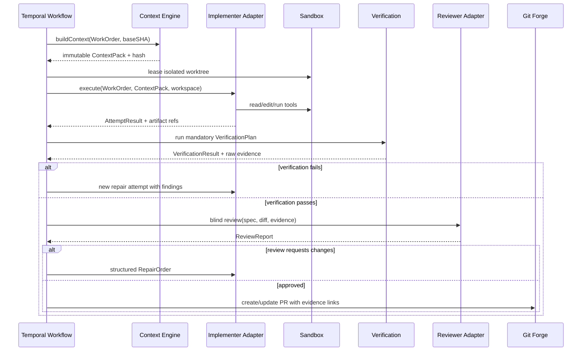
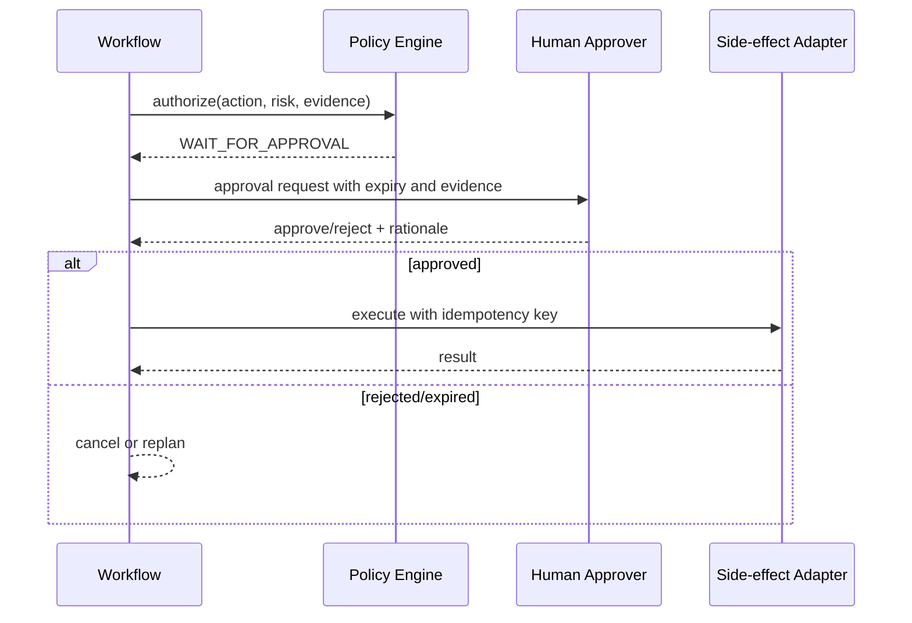

# 5. Critical Sequence Diagrams

## Standard task

```mermaid
sequenceDiagram
  participant T as Temporal Workflow
  participant C as Context Engine
  participant A as Implementer Adapter
  participant S as Sandbox
  participant V as Verification
  participant R as Reviewer Adapter
  participant G as Git Forge

  T->>C: buildContext(WorkOrder, baseSHA)
  C-->>T: immutable ContextPack + hash
  T->>S: lease isolated worktree
  T->>A: execute(WorkOrder, ContextPack, workspace)
  A->>S: read/edit/run tools
  A-->>T: AttemptResult + artifact refs
  T->>V: run mandatory VerificationPlan
  V-->>T: VerificationResult + raw evidence
  alt verification fails
    T->>A: new repair attempt with findings
  else verification passes
    T->>R: blind review(spec, diff, evidence)
    R-->>T: ReviewReport
    alt review requests changes
      T->>A: structured RepairOrder
    else approved
      T->>G: create/update PR with evidence links
    end
  end
```

## Human approval

```mermaid
sequenceDiagram
  participant W as Workflow
  participant P as Policy Engine
  participant H as Human Approver
  participant X as Side-effect Adapter
  W->>P: authorize(action, risk, evidence)
  P-->>W: WAIT_FOR_APPROVAL
  W->>H: approval request with expiry and evidence
  H-->>W: approve/reject + rationale
  alt approved
    W->>X: execute with idempotency key
    X-->>W: result
  else rejected/expired
    W-->>W: cancel or replan
  end
```
